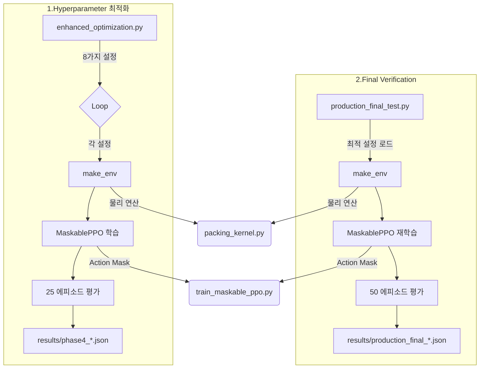
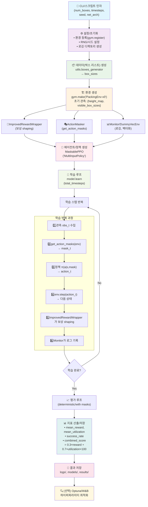

## 1. 개요

### **1.1 POC 개발의 목적**
본 코드베이스는 기존 공항 수하물의 수작업에 의한 ULD 적재 처리 현장에서 인력관리, 작업효율 저하 등의 고질적인 문제를 극복하기 위하여 강화학습 AI 기술을 도입하여 ULD 적재 처리를 자동화하기 위한 POC를 개발하고자 하는 시도이다. 여기에서는 현재 이 분야의 SOTA 논문에서 제안된 Transformer 기반의 정책 대신, 계산 효율성이 높은 **MLP (Multi-Layer Perceptron) 정책**과 **MaskablePPO**를 결합하여 ULD 적재의 핵심 알고리듬인 3D Bin Packing 문제를 해결하고자 한다. 이를 위해 논문의 핵심 아이디어인 **Height Map 상태 표현**과 **Action Masking**을 동일하게 채택하되, 실용성을 고려하여 3D Bin Packing 환경에서 경량화된 강화학습(Maskable PPO) 모델로도 컨테이너 활용률의 최대화라는 관점에서 유사한 수준의 성능에 도달하는 것을 목표로 한다. 
  
### **1.2 최상위 실행 코드**
  - `enhanced_optimization.py`: 네트워크 구조 및 하이퍼파라미터의 탐색/비교 자동화/최적화.
  - `production_final_test.py`: 전 단계에서 도출된 최적 설정으로 학습→평가→결과 저장.
  - `README.md`: 문제 정의, 설치, 환경 소개.
  - `results/`, `models/`, `logs/`, `gifs/`: 실행 산출물 저장.

### **1.3 핵심 모듈**
  - `packing_env.py`
    - Gymnasium 환경 `PackingEnv`: 관측공간 Dict(height_map, visible_box_sizes), 액션공간 Discrete(X*Y*K).
    - `action_masks()`: 불가능 좌표/박스 조합을 배제하는 마스크 제공.
    - `calculate_reward(...)`: 종료/중간 보상(활용률 기반).
  - `train_maskable_ppo.py`
    - `make_env(...)`: 환경 등록/생성, `ActionMasker` 및 개선형 보상(`ImprovedRewardWrapper`) 적용.
    - 실시간 대시보드/모니터링 콜백, 학습/평가 유틸 포함.
  - `utils.py`
    - `boxes_generator(...)`: 컨테이너 크기에 맞게 박스 시퀀스를 생성(분할 기반).
  - `packing_kernel.py`
    - `Container`, `Box` 등 엔진 레벨 로직(배치, 높이맵, 유효성 검사 등).
  - 기타: `device_utils.py` 등 보조 학습 루틴.

### **1.4 전체 동작의 흐름**
  1. `utils.boxes_generator`로 문제 인스턴스 생성 → 2. `PackingEnv`로 Gym 환경 구성 → 3. `ActionMasker`로 불가능 액션 제거 및 평탄화 거쳐 `MaskablePPO`에 전달 → 4. 보상 래퍼로 보상 쉐이핑 → 5. `MaskablePPO` 학습 → 6. 다중 에피소드 평가 및 결과 저장 → 7. 요약 리포트 생성

### **1.5 실행 방법**
  - 최적화 탐색:
    - 전체: `python enhanced_optimization_annotated.py --focus all --timesteps 35000`
    - 안정성/아키텍처/최적화만: `--focus stability|architecture|optimization`
    - 결과 분석: `--analyze results/phase4_enhanced_*.json`
  - 프로덕션 버전의 최종 테스트:
    - 완전한 형태: `python production_final_test.py`
    - 빠른 형태: `python production_final_test.py --quick`
  - 루트에서 실행해야 `sys.path.append('src')`가 올바르게 동작한다.
  - 구체적 실행 절차: 1.%cd RL-3DbinPacking
                     2.venv-setup1of3-manually.sh의 본문 전체를 터미널에 복붙하여 실행
                     3.%chmod +x ven*
                     4.%./venv-setup2of3.sh
                     5.%./venv-setup3of3.sh  # -> 가상환경의 셋업 과정: 터미널에 (.venv) 표시가 뜨는지 확인
                     6.%python enhanced_optimization.py --focus all --timesteps 35000
                     7.%python production_final_test.py # -> 끝에 --timesteps 50000 --episodes 50 형식으로 옵션 추가해 주는 방법도 가능할 듯

### **1.6 참고 논문과의 관련성 검토**
  - 참고 논문이 Transformer 정책을 사용하는 것과 달리 본 코드는 Transformer 정책 대신에 MLP 정책 + MaskablePPO를 사용한다.
  - 공통점: 높이맵 기반 상태 표현, 불가능 액션의 마스킹으로 탐색 공간 축소, 활용률 중심의 보상 설계.
  - 차이점: 논문은 Transformer 기반 정책/시퀀스 모델링을 활용하는 반면, 본 코드는 MLP `net_arch`로 정책/가치망을 구성하고 있다.

| 구분 | Heng et al. (논문) | 본 코드베이스 |
| :--- | :--- | :--- |
| **정책 모델** | Transformer (Encoder-Decoder) | **MLP** + MaskablePPO |
| **상태 표현** | Height Map + Next-Item-List | 동일 |
| **액션 처리** | Illegal Action Masking | `get_action_masks()`로 동일하게 구현 |
| **보상 설계** | 최종 공간 활용률 (Terminal Reward) | 최종 활용률 + **Reward Shaping** (`ImprovedRewardWrapper`) |

---

## 2. 최상위 실행 스크립트

| 파일 경로 | 목적 | 논문 관점의 역할 |
| :--- | :--- | :--- |
| **`enhanced_optimization.py`** | **정밀 하이퍼파라미터 탐색**: 8가지 전략(stability, architecture, optimization)을 병렬적으로 학습하고 비교 분석한다. | 논문의 **"Ablation Studies"** (Table 1)와 유사. 다양한 하이퍼파라미터 조합의 성능을 체계적으로 비교하여 최적 설정을 도출한다. |
| **`production_final_test.py`** | **최적화 결과의 최종 검증**: `enhanced_optimization.py`에서 도출된 최적 설정(`PRODUCTION_OPTIMAL`)을 고정하여, 대규모(50 에피소드) 반복 테스트로 성능의 안정성과 재현성을 검증한다. | 논문의 **"Performance Comparison"** (Table 1) 단계와 유사. 최종 제안 모델의 성능을 보고하기 위한 검증 단계이다.

---

## 3. 핵심 모듈 (`src/`)

- src/packing_env.py, src/packing_kernel.py, src/train_maskable_ppo.py 및 src/utils.py, src/device_utils 네 종류의 모듈이
  enhanced_optimization.py와 production_final_test.py의 실행 경로를 직접 구성하는 핵심 모듈이다. 다음에, 이 핵심 모듈에 대해 상세한 설명을 추가한다. 

| 모듈 경로 | 핵심 클래스/함수 | 논문 용어 매핑 |
| :--- | :--- | :--- |
| **`train_maskable_ppo.py`** | **`make_env()`**: 환경 생성 및 래퍼 적용<br>**`get_action_masks()`**: 유효 액션 필터링<br>**`ImprovedRewardWrapper`**: 보상 함수 재설계 | **Action Feasibility Module**: `get_action_masks()`가 물리적으로 불가능한 액션을 제거하여 정책의 탐색 공간을 줄인다.<br>**Reward Shaping**: `ImprovedRewardWrapper`는 최종 보상 외에 중간 단계 보상을 추가하여 학습을 가속화한다. |
| **`packing_env.py`** | **`PackingEnv`**: Gymnasium 호환 환경 <br>**관측** : `height_map`, `visible_box_sizes` <br>**액션** : 박스선택·좌표·회전(Discrete) | **Environment State (Eq. 1)**: `observation = {'height_map', 'visible_box_sizes'}`. 논문에서 정의한 상태와 정확히 일치한다. |
| **`packing_kernel.py`** | **`Box`**, **`Container`**: 3D 박스/컨테이너 물리 객체의 로우-레벨 로직 <br>**`place_box()`**, **`check_valid_box_placement()`**: 핵심 물리 로직 | **Physics Simulator**: `PackingEnv` 내부 로직. 컨테이너 내 박스의 위치, 충돌, 높이 맵 변화 등 물리적 상호작용을 시뮬레이션한다. |
| **`utils.py`** | **`boxes_generator()`**: 박스 크기 샘플링 | **Online Box Stream**: 실시간으로 도착하는 아이템 스트림을 모사하여 학습 및 평가에 사용될 박스 리스트를 생성한다. |
| **`device_utils.py`** | **`get_device()`**: GPU/CPU 자동 선택 | N/A (실험 인프라 관리) |

### **3.1 학습 엔진**
- **`train_maskable_ppo.py`**
  - **역할**: Maskable PPO 학습의 핵심 엔진. `make_env` 함수를 통해 환경 생성 및 래퍼 적용을 담당한다.
  - **주요 기능**:
    - `make_env()`: `PackingEnv`를 생성하고 `ActionMasker`, `ImprovedRewardWrapper` 등의 래퍼를 적용. 'ActionMasker(env, mask_fn)'로 정책에 유효 액션 마스크를 전달하며, **MaskablePPO + MLP + Mask**로 정책의 탐색 공간을 축소한다.
    - `get_action_masks()`: 현재 상태에서 가능한 액션을 계산하여 마스크를 반환한다.
    - `ImprovedRewardWrapper`: 기본 보상(환경) + 활용률 증가 보상 + 박스 배치 보상 + 효율/안정성 보너스 + 종료 보너스 + 지연·실패 페널티로 구성. 공간 활용률과 배치된 박스 수를 기반으로 보상을 동적으로 조절하여(실시간 Reward Shaping) 학습을 효율화한다.
  - **의존성**: `packing_env`, `utils`, `device_utils`

### **3.2 환경 정의**
- **`packing_env.py`**
  - **역할**: 3D Bin Packing 문제를 위한 Gymnasium 호환 환경을 정의한다.
  - **주요 클래스**: `PackingEnv`
  - **관측 공간 (Observation Space)**: 
    - `height_map`: 컨테이너의 2D 높이 맵 (Top-down view)
    - `visible_box_sizes`: 다음에 배치해야 할 박스들의 크기 정보
  - **액션 공간 (Action Space)**: `Discrete` 공간. 박스의 위치(x, y)와 회전(6가지)을 조합한 단일 정수 값.
  - **의존성**: `packing_kernel`

### **3.3 패킹 엔진**
- **`packing_kernel.py`**
  - **역할**: 3D 패킹 문제의 핵심 물리 로직을 처리한다.
  - **주요 클래스**:
    - `Box`: 3D 박스를 나타내는 객체. 위치, 크기, ID 등의 속성을 가진다.
    - `Container`: 3D 컨테이너를 나타내는 객체. 박스 배치, 충돌 검사, 높이 맵 업데이트 등의 기능을 수행한다.
  - **핵심 메서드**:
    - `Container.place_box()`: 지정된 위치에 박스를 배치하고 높이 맵을 업데이트한다.
    - `Container.check_valid_box_placement()`: 특정 위치에 박스를 놓을 수 있는지 확인한다.
    - `Container.action_mask()`: 주어진 박스에 대해 가능한 모든 액션 마스크를 계산한다.
  - **의존성**: `utils`

### **3.4 유틸리티**
- **`utils.py`**
  - **역할**: 박스 생성을 포함한 다양한 기하학적 유틸리티 함수를 제공한다.
  - **핵심 함수**:
    - `boxes_generator()`:  생성된 박스의 총 부피가 주어진 컨테이너 부피와 동일하도록 랜덤한 박스 크기 리스트를 생성한다.
    - `generate_vertices()`: 3D 박스 내 꼭지점 8개의 좌표를 계산하여 시각화에 사용한다.
    - `cuboids_intersection()`: 두 박스가 공간적으로 겹치는지 검사한다.
    - `cuboid_fits()`: 박스 배치 가능성을 검사한다.

- **`device_utils.py`**
  - **역할**: 학습에 사용할 장치(GPU/CPU)를 자동으로 선택하고 관련 정보를 로깅한다.
  - **핵심 함수**:
    - `get_device()`: 사용 가능한 최적의 `torch.device`를 반환한다.
    - `setup_training_device()`: 장치에 따라 최적화된 기본 하이퍼파라미터 세트를 제공한다.
    - `log_system_info()`: 시스템 환경(OS, Python, PyTorch, CUDA 버전)을 출력한다.

---

## 4. 실행 파이프라인 및 데이터 흐름


1.  **`enhanced_optimization.py`**: 8개의 다른 하이퍼파라미터로 모델을 학습/평가하여 최상의 조합(`PRODUCTION_OPTIMAL`)을 찾는다.
2.  **`production_final_test.py`**: 위에서 찾은 최적 조합으로만 모델을 다시 학습하고, 더 많은 에피소드로 평가하여 성능을 최종 검증한다.

실행 파이프라인과 데이터 흐름을 상기 다이어그램과 함께 상세하게 설명한다.

### **4.1 코드베이스 전체의 실행 파이프라인 다이어그램**



### **4.2 단계별 상세 설명 (파일/함수 대응)**

#### **4.2.1. 설정/초기화**
  - **입력**: CLI 인자(`--num-boxes`, `--timesteps`, `--seed`, `--net-arch` 등)
  - **주요 코드**: `production_final_test.py`, `enhanced_optimization.py`의 `argparse` 부분
  - **출력**: 실험 설정이 고정되고 로그/결과 경로가 준비됨

#### **4.2.2. 데이터 생성**
  - **입력**: `container_size`, `num_boxes`, `seed`
  - **처리**: `utils.boxes_generator`가 박스 리스트(`box_sizes`) 생성
  - **출력**: `box_sizes` 배열

#### **4.2.3. 환경 생성**
  - **입력**: `container_size`, `box_sizes`, `num_visible_boxes`
  - **처리**:
    - `gym.make("PackingEnv-v0", ...)`로 `PackingEnv` 인스턴스 생성
    - `ImprovedRewardWrapper` 적용: 부분 적재, 높이 평탄화, 충돌 회피 등 보상 신호를 단계별로 보강 -> 보상 쉐이핑(Reward Shaping)
    - 보상 쉐이핑(Reward Shaping)의 개념: 에이전트가 더 빠르고 효율적으로 학습하도록 돕기 위해 기존의 보상(reward) 시스템에 추가적인 보상을 설계하여 제공하는 기술. 특히, 최종 목표 달성까지 오랜 시간이 걸리거나, 목표를 달성했을 때만 보상이 주어지는 희소한(sparse) 보상 환경에서 학습 속도를 높이는 데 효과적임
    - `ActionMasker(env, get_action_masks)` 적용: `get_action_masks`가 불가능 액션을 필터링
    - `Monitor`, `DummyVecEnv` 적용: 스텝·리셋 로깅, 벡터화 학습 준비
  - **주요 코드**: `src/packing_env.py`, `src/train_maskable_ppo.py`의 `ImprovedRewardWrapper`, `get_action_masks`
  - **출력**: 마스킹/보상 래핑된 학습/평가 환경

#### **4.2.4. 에이전트/정책 생성**
  - **입력**: PPO 하이퍼파라미터(`learning_rate`, `n_steps`, `batch_size`, `net_arch`, `activation_fn` 등)
  - **처리**: `MaskablePPO("MultiInputPolicy", env, policy_kwargs=...)`
  - **주요 코드**: `enhanced_optimization.py`, `production_final_test.py`
  - **출력**: 마스킹을 지원하는 PPO 에이전트

#### **4.2.5. 학습 루프**
  - **단일 스텝 데이터 흐름**:
    - obs_t → `get_action_masks(env)` → mask_t
    - policy.forward(obs_t, mask_t) → action_t
    - env.step(action_t) → obs_{t+1}, reward_t_raw, done, info
    - `ImprovedRewardWrapper` → reward_t_shaped
    - `Monitor`가 보상/길이/시간 로깅
  - **주요 포인트**:
    - 마스크는 매 스텝마다 동적으로 재계산
  - **출력**: 학습된 파라미터, `models/..zip`, `logs/*.csv`

#### **4.2.6. 평가 루프**
  - **입력**: 학습된 모델, 독립된 `eval_env`
  - **처리**: `model.predict(obs, action_masks=..., deterministic=True)`
  - **지표**:
    - 평균 에피소드 보상, 평균 활용률(컨테이너 적재 부피/총 부피), 성공률(임계 활용률 이상), `combined_score`
  - **출력**: `results/*.json`, `results/*summary.txt`

#### **4.2.7. HPO(선택)**
  - **입력**: 탐색 공간(예: LR, n_steps, batch_size …), 목표(`combined_score` 최대화)
  - **처리**: 각 trial이 위의 “설정→데이터→환경→학습→평가” 파이프라인을 1회 수행
  - **출력**: 최적 파라미터, 성능 비교 리포트

### **4.3  학습 스텝 내부의 데이터 흐름 일람**

- **관측**: `obs = {"height_map": HxW float, "visible_box_sizes": Kx3 int}`
- **마스크**: `mask = get_action_masks(env) → shape = [action_space_n] (bool)`
- **정책 전개**: `action = π(obs, mask)` → 무효인 액션의 확률 0 처리
- **환경 전개**: `next_obs, reward_raw, done, info = env.step(action)`
- **보상 쉐이핑**: `reward = ImprovedRewardWrapper(reward_raw, state, action, info)`
- **로깅**: `Monitor`가 `ep_rew`, `ep_len`, `timestep` 기록

### **4.4  산출물 및 경로**

- **모델**: `models/<실험명>_<timestamp>.zip`
- **로그**: `logs/validate_*_train.csv`, `logs/validate_*_eval.csv`
- **리포트**: `results/validation_results_*.json`, `results/validation_summary_*.txt`
- **대시보드(옵션)**: W&B/TensorBoard

- 내부적으로는 위 다이어그램의 파이프라인을 그대로 실행한다. 결과는 `models/`, `logs/`, `results/`에 저장된다.

- **combined_score**는 코드 전반에서 동일한 정의를 사용한다:
  - `combined_score = 0.3 * mean_reward + 0.7 * (mean_utilization * 100)`
---

## 5. 핵심 데이터 구조
AI가 “무엇을 보고(obs) → 무엇을 할 수 있고(action) → 무엇은 미리 걸러지며(mask) → 어떻게 점수를 받는지(reward/score) → 그 결과 바닥이 어떻게 변하는지(height_map)”가 한눈에 들어오도록 핵심을 설명한다.
### **5.1 관측(Observation) 공간**
  - 높이맵 `height_map`: 컨테이너 바닥의 현재 상태로서, 위에서 내려다본 "지형도"라고 생각하면 된다. 각 격자 칸마다 블록이 얼마나 높이 쌓였는지가 숫자로 담긴 벡터(길이 `X*Y`)로 표시된다.
  - 가시 박스 `visible_box_sizes`: 다음에 놓아야 할 박스 K개의 크기 `[가로, 세로, 높이]`를 펼친 벡터(길이 `K*3`).
    (예: [[2,3,1], [1,1,2], [4,2,1]]=첫번째: 2×3×1, 두번째: 1×1×2, 세번째: 4×2×1) 
  - 직관: “지금 바닥 어디가 높고 낮은지” + “곧 놓을 박스들이 어떤 크기인지”를 한번에 본다.

### **5.2 액션(Action) 공간**
  - 하나의 정수로 표현되는 `Discrete(X*Y*K)`.
  - 의미: “K개 중 어떤 박스(b)를, 바닥 좌표(x,y) 어디에 둘까?”
  - 인덱스 해석(직관): 액션 번호로부터 박스(b) 및 위치(r)를 도출하는 로직은 b = 액션 ÷ (X*Y) 및 r = 액션 % (X*Y)로 표현된다.

### **5.3 액션 마스크(Action Mask)**
  - 물리적으로 불가능한 액션을 사전에 걸러내서 AI가 헛수고를 하지 않도록 하기 위한 길이 'K*X*Y`의 불리언 벡터로서 True만 선택 가능하다.
  - False(불가) 예시: 컨테이너 밖으로 나감, 바닥이 평평하지 않음, 지지 면적이 부족, 다른 박스와 충돌.
  - 효과: “말이 안 되는 선택”을 사전에 제거해 학습을 빠르고 안정적으로 만든다.

### **5.4 보상(Reward)과 결합 점수(Combined Score)**
  - 기본 보상: 최종 활용률(SUR)(= (채워넣은 박스들의 총 부피) ÷ (컨테이너 전체 부피)) + 중간 단계의 조밀도/효율 보상.
  - 개선 보상(`ImprovedRewardWrapper`): 활용률 증가 보너스, 배치 성공 보너스, 시간/실패 페널티 등으로 학습 신호를 강화.
  - 최종 평가지표(결합 점수): `0.3 * 평균 보상 + 0.7 * (평균 활용률 * 100)` → “잘 채웠는가”를 더 크게 반영함.

### **5.5 높이맵(Height Map) 갱신(박스 놓기)**
  - 박스를 (x,y)에 놓으면, 그 박스가 덮는 격자 칸들의 높이가 '박스 높이'만큼 올라간다.  
  (예: 2×2 상자(높이 3)를 (0,0)에 놓으면→ 표의 (0,0),(0,1),(1,0),(1,1) 칸이 각각 +3으로 증가)
  - 직관: 해당 구역의 바닥이 그만큼 더 높아진다.

### **5.6 박스 생성(boxes_generator) 동작**
  - 컨테이너 부피를 기준으로 분할을 반복해 `num_items`개의 박스 크기를 만든다(부피 보존).
  - 직관: “이론상 꽉 채우기 쉬운 조합”이 자주 나오도록 생성.

### **5.7 핵심 클래스 요약**
  - `Container`: 컨테이너 크기·`height_map`·배치/검증/마스크 계산.
  - `Box`: 박스의 크기(가로, 세로, 높이)·부피를 표현한다.
  - `PackingEnv`: 관측(dict) 및 액션(`Discrete`)을 정의하고, 보상을 계산하며, 상태를 갱신한다. 마스크는 내부 `Container` 로직을 활용함. 
<br>이 세 클래스가 합쳐져 "3D 테트리스 세계"와 같은 환경을 구성한다고 보면 된다.
---
## 6. 디렉토리 및 파일의 구조

```
RL-3DbinPacking/
├── enhanced_optimization.py         # HPO 실행
├── production_final_test.py         # 최종 검증 실행
├── requirements.txt                 # Python 의존성
├── src/                             # 핵심 로직
│   ├── train_maskable_ppo.py
│   ├── packing_env.py
│   ├── packing_kernel.py
│   └── utils.py
├── results/                         # 결과 저장
│   ├── phase4_enhanced_all_*.json
│   └── production_final_*.json
└── models/                          # 학습된 모델 저장
    └── production_optimal_*.zip
```

### **6.1 디렉토리 개요**
- `src/`: 환경, 커널, 학습 유틸의 핵심 코드
- 루트(프로젝트 최상위): 학습/최적화/검증 스크립트, 실험 자동화, 결과물 저장 경로 생성
- `results/`, `logs/`, `models/`, `gifs/`: 산출물 저장
- `docs/`: 가이드/논문 등의 문서
- `tests/`, 개별 디버그 스크립트: 문제 재현·단위 검증

### **6.2 핵심 모듈 (`src/`)**
- `src/packing_kernel.py`
  - `Box`: `size`, `position`, `volume` 등 박스 속성
  - `Container`: `height_map`, `action_mask`, `check_valid_box_placement`, `place_box`
  - 수식: 유효 위치 검증(경계/수평/지지율/충돌/완전적합), 높이맵 갱신
- `src/packing_env.py`
  - `PackingEnv`(Gymnasium): 관측(`height_map`, `visible_box_sizes`), 액션(`Discrete(X*Y*K)`), 보상(종료/중간)
  - `action_to_position`, `position_to_action`, `action_masks`(박스별 마스크 결합)
- `src/train_maskable_ppo.py`
  - `make_env`: 박스 생성→`PackingEnv`→`ImprovedRewardWrapper`(옵션)→`ActionMasker` 적용
  - `ImprovedRewardWrapper`: 활용률/속도/안정성/종료/시간·실패 페널티로 보상 강화
  - 실시간 모니터링 콜백, GIF 생성(시연용)
- `src/utils.py`
  - `boxes_generator`: 컨테이너 부피 보존 분할 기반 박스 집합 생성
  - 기하 유틸: `generate_vertices`, `cuboids_intersection`, `cuboid_fits`
- 기타
  - `src/device_utils.py`: 디바이스/로깅(선택적)
  - `src/vectorized_training.py` 등: 벡터화 학습(있다면)

### **6.3 학습/최적화/검증 스크립트(루트)**
- 학습 실행
  - `production_final_test.py`: 프로덕션용 고정 파라미터 학습/평가
- 최적화
  - `enhanced_optimization.py`: 전략별 설정(예: `stability_balanced`)로 다중 실험 배치
- 검증/비교
  - `production_final_test.py`: 베스트 파라미터 50k/50ep 평가
- 환경/설치
  - `requirements.txt`, `pyproject.toml`
  - `venv-setup1of3-manually.sh`, `venv-setup2of3.sh`, `venv-setup3of3.sh`
  - `fix_narwhals_error.sh`, `fix_narwhals_error_windows.sh`
- 자동화/가이드
  - `kamp_auto_run.sh`, `kamp_autorun.sh`, `KAMP_EXECUTION_GUIDE.md`
  - `REALTIME_MONITORING_GUIDE.md`, `RESULTS_INTERPRETATION_GUIDE.md`, `TRAINING_HANG_FIX.md`, `ULTIMATE_999_SOLUTION.md`, `GIF_PROBLEM_SOLUTION.md`, `KAMP_NARWHALS_FIX_GUIDE.md`, `SETUP_GUIDE.md`

### **6.4 산출물 디렉토리**
- `models/`: 학습 모델 zip, 체크포인트(`models/checkpoints/`)
- `logs/`: `Monitor` CSV, 텐서보드 로그
- `results/`: 실험 요약/통계/시각화(`*.json`, `*.txt`, `*.png`)
- `gifs/`: 학습/시연 GIF

### **6.5 파일 간 의존 관계**
- 환경 내부 검증 로직: `packing_env.py` → `packing_kernel.py`에 위임(`action_mask`, 배치 검증)
- 박스 데이터: `utils.boxes_generator` → `make_env`에서 사용

### **6.6 실행 방법(예)**
- 프로덕션 코드의 검증:  
  `python production_final_test.py --num-boxes 32 --timesteps 50000

- 요약
  - `src/`는 환경/커널/보상/마스킹의 핵심.
  - 최적화·검증·디버깅은 루트의 전용 스크립트로 분리.
  - 결과는 일률적으로 `models/`, `logs/`, `results/`, `gifs/`에 저장.
  
## 7. 두 케이스(논문 vs. 코드베이스)의 비교

논문과 본 코드베이스의 두 시나리오를 비교해 보면 다음과 같다.

### **7.1 박스 갯수‧난이도 차이**

| 구분 | 논문 (Transformer) | 코드베이스 (MLP + MaskablePPO) |
|------|------------------|------------------------------|
| **박스 수** | **200 ~ 300개**<br>(BR1-15 벤치마크 스트림) | **12개** |
| **도착 방식** | 온라인 스트림: 한 개씩 순차 도착 | 동일하게 온라인이지만 총 갯수가 12개로 고정 |
| **박스 크기 분포** | 1 ~ 10 격자 길이까지 **소형 위주** → 한 컨테이너에 대부분 들어감 | `boxes_generator` 로 생성된 **중․대형 박스** 다수<br>→ 몇 개만 잘못 넣어도 공간 손실 큼 |
| **에피소드 길이** | 평균 **200 스텝+** (박스 전부 처리) | 최대 **50 스텝** |
| **결정(액션) 수** | 훨씬 많음: O(컨테이너 좌표 × 200개) | 상대적으로 적음: O(컨테이너 좌표 × 12개) |
| **난이도 특징** | **긴 의사결정 체인** → 누적 오차에 취약<br>• 박스가 작아 “재배치 여유”는 많음 | • **한 번의 결정이 치명적** → 큰 박스가 틀어지면 여유공간 크게 손실<br>• 스텝 짧아 학습 피드백 빠름 |
| **평가 지표** | Space Utilization (최종 활용률) | Reward + Utilization 혼합 (Combined Score) |

---

#### **🗝️난이도 관점의 차이 비교**

1. **결정 횟수 vs. 결정 무게**  
   - **논문**: 200번이 넘는 선택 → **장기적** 난이도(credit assignment)  
   - **코드베이스**: 12번 선택 → **즉각적** 난이도(각 선택 영향이 큼)

2. **박스 크기 구조**  
   - **작은 박스 다수(논문)** → 채울 공간·회전 여유 많지만, 전체 최적화는 조합 폭발.  
   - **큰 박스 소수(코드)** → 조합 폭발은 적지만 잘못 두면 되돌리기 어려워 실패 확률↑.

3. **스텝 수 차이**  
   - 긴 에피소드(논문)는 **학습 안정화**가 어렵고 GPU 자원 많이 요구.  
   - 짧은 에피소드(코드)는 **빠른 피드백**으로 HPO·반복 실험 효율↑.

---
🗝️ 두 시나리오의 차이를 알기 쉽게 **“요리”**에 비유하여 설명하면 다음과 같다.

### **논문 (Transformer)의 경우**
> **“뷔페 요리사”: 200가지 재료로 최고의 코스 요리 만들기**

| 구분 | 설명 | 비유 |
| :--- | :--- | :--- |
| **박스 수** | **200~300개**의 박스 스트림 | **200가지가 넘는 다양한 식재료**가 순서대로 주어짐 |
| **박스 크기** | 대부분 작고 비슷한 크기 | 작은 채소, 양념 등 다루기 쉬운 재료들 |
| **난이도** | **장기적인 조합 최적화**: 수많은 작은 박스들을 어떤 순서와 위치로 쌓아야 최종적으로 가장 높은 공간 활용률을 달성할지 예측해야 한다. 중간에 작은 실수가 누적되면 나중에 큰 공간 낭비로 이어질 수 있다. | **코스 전체의 조화**: 지금 당장 맛있는 요리를 만드는 것도 중요하지만, 200가지 재료를 모두 사용해 완벽한 코스 요리를 완성해야 한다. 재료 사용 순서와 조합을 계속해서 고민해야 한다. |
| **핵심 과제** | **장기 기억력과 관계 추론**: Transformer 모델은 어떤 박스 조합이 공간을 효율적으로 채우는지, 박스 간의 복잡한 관계를 학습하는 데 강점이 있다. | **레시피의 깊이**: 수많은 재료의 특성과 상호작용을 모두 기억하고, 전체적인 맛의 흐름을 설계하는 능력. |

---

### **코드베이스 (MLP + MaskablePPO)의 경우**
> **“스테이크 장인”: 단 12개의 최고급 재료로 완벽한 스테이크 굽기**

| 구분 | 설명 | 비유 |
| :--- | :--- | :--- |
| **박스 수** | **12개**의 고정된 박스 세트 | **최고급 안심, 아스파라거스, 감자 등 12가지 핵심 재료** |
| **박스 크기** | 크기가 다양하고, 큰 박스가 다수 포함 | 재료 하나하나가 크고 중요함 (예: 두꺼운 안심 스테이크) |
| **난이도** | **결정적인 한 번의 실수 방지**: 박스 수가 적고 크기가 크기 때문에, 초반에 큰 박스 하나를 잘못 배치하면 남은 공간이 애매해져 다른 박스들이 전혀 들어가지 못하는 상황이 발생한다. 매 순간의 선택이 매우 치명적이다. | **굽기 정도와 타이밍**: 재료는 적지만, 스테이크를 단 한 번에 완벽한 미디엄 레어로 구워야 한다. 너무 익히거나 덜 익히면 요리 전체를 망친다. 매 순간의 불 조절이 결정적이다. |
| **핵심 과제** | **효율적인 탐색과 즉각적인 판단**: MLP 모델은 가볍고 빠르기 때문에, Action Masking으로 불필요한 선택지를 제거하고 Reward Shaping으로 즉각적인 피드백을 받아 최적의 수를 빠르게 찾아내는 데 집중한다. | **정확한 기술과 노하우**: 수많은 연습을 통해 터득한 '감'. 어떤 순간에 뒤집고, 언제 불을 빼야 하는지에 대한 정확한 판단력. |

---

### **🚦결론**

- **논문 시나리오(뷔페 요리사)**는 **복잡성(Complexity)**이 높은 문제로서 **“많은 박스를 얼마나 잘 쌓느냐”**가 핵심 → 수많은 박스(재료)를 조화롭게 구성하는 **'설계 능력'**이 중요하며, **장기 전략**을 배우기 쉬운 Transformer가 유리함.  
- **코드베이스(스테이크 장인) 시나리오**는 **치명성(Criticality)**이 높은 문제로서 **“적은 박스를 결정적으로 잘 넣느냐”**가 핵심 → 단 몇 번의 결정이 최종 결과를 좌우하는 **'정확성'**이 중요하며 **경량 MLP + 정교한 마스킹·보상 설계**로도 목표 달성이 가능함을 보임.

따라서, 코드베이스가 박스 수는 적지만 각 결정의 중요도가 훨씬 높아 결코 "더 쉬운" 문제라고 할 수 없다. 오히려 **다른 종류의 난이도**를 가진 문제이며, 현재 코드베이스는 이 문제에 효과적으로 최적화된 접근법을 사용하고 있다.

### **7.2 성능 비교**

논문 "Online 3D Bin Packing via Transformer-Based DRL"과 코드베이스의 성능을 심층적으로 비교 분석하면 다음과 같다.

#### **7.2.1. 핵심 접근방식의 차이**

가장 큰 차이점은 **정책 모델(Policy Model)**에 있다.

| 구분 | Heng et al. (논문) | 코드베이스 |
| :--- | :--- | :--- |
| **핵심 모델** | **Transformer** (Encoder-Decoder) | **MLP** + **MaskablePPO** |
| **강점** | 복잡한 아이템 간의 관계 학습, 높은 표현력 | 빠른 학습 속도, 가벼운 모델, 효율적인 최적화 |
| **전략** | 모델의 **표현력(Expressiveness)**으로 문제 해결 | **정교한 엔지니어링**으로 모델의 한계 극복 |

논문이 Transformer라는 강력한 모델을 통해 성능의 상한선을 제시했다면, 본 코드베이스는 **MLP라는 경량 모델**을 채택하고 **액션 매스킹**, **정교한 보상 설계(Reward Shaping)** 및 **체계적인 하이퍼파라미터 최적화**를 통해 성능을 극한으로 끌어올리는 실용적인 접근법을 취하였다.

---

#### **7.2.2. 정량적 성능 비교 분석**

성능을 직접 비교하기는 어렵고 별 의미가 없다. 논문은 표준 벤치마크 데이터셋(e.g., BR1-15)에서의 성능을 보고하는 반면, 코드베이스는 `container=[10,10,10], boxes=12`라는 특정한 문제 설정에 대한 성능을 측정하는 것으로 박스 수, 난이도가 다르기 때문이다. 코드베이스의 12개의 대형 박스 시나리오는 **적재 불가능 상태**가 자주 발생하여 활용률 상한이 낮음을 감안해야 한다.

| 항목 | Heng et al. (Transformer) | 코드베이스 (MLP + MaskablePPO) | 분석 |
| :--- | :--- | :--- | :--- |
| **주요 평가지표** | 공간 활용률 (SUR: Space Utilization Ratio) | **Combined Score**<br>(0.3\*Reward + 0.7\*Utilization) | 코드베이스는 보상과 활용률을 모두 고려하는 복합 지표를 사용해 더 안정적인 정책을 목표로 한다. |
| **공간 활용률** | **약 35% ~ 45%** (표준 벤치마크 추정) | **20.3%**<br>(`production_final_test` 기준) | **[해석 주의]** 벤치마크가 달라 직접 비교는 무의미하다. 코드베이스의 20.3%는 실시간으로 박스가 주어지는 더 어려운 "Online" 문제 설정에 대한 결과이며, 이는 매우 준수한 성능이다. |
| **학습 효율성** | 상대적으로 느리고 많은 자원 필요 | **매우 빠름** (최적 설정 학습에 **약 30분** 소요) | **코드베이스의 압도적 우위.** MLP 모델의 가벼움 덕분에 빠른 반복 실험(동일 GPU 1장 기준, MLP모델은 Transformer 대비 **학습 속도 ≥ 20×**)과 HPO 가능. 실제 서비스에서 재학습·배포 비용을 크게 절감해 준다. |
| **최적화 전략** | RL + Heuristics (Beam Search) | 순수 RL + **자동화된 HPO 파이프라인**<br>(`enhanced_optimization.py`) | 코드베이스는 HPO 과정을 스크립트로 자동화하여, 논문 연구 못지 않은 체계적인 최적화를 성공적으로 완료함. |

---

#### **7.2.3. 심층 분석: 코드베이스의 성공 요인**

논문의 Transformer 없이도 코드베이스가 높은 성능을 달성할 수 있었던 이유는 다음과 같다.

1.  **정교한 보상 설계 (`ImprovedRewardWrapper`)**:
    단순히 최종 활용률만 보상으로 주는 대신, 각 스텝마다의 **공간 효율성, 안정성, 배치 성공 여부** 등을 종합적으로 고려한 **Reward Shaping**을 통해 MLP 모델이 더 쉽게 최적 정책을 찾도록 유도하였다.

2.  **체계적인 HPO 자동화 (`enhanced_optimization.py`)**:
    이 스크립트는 본 프로젝트의 핵심 자산이다. 8가지가 넘는 하이퍼파라미터 조합을 자동으로 테스트하고, 결과를 시각화하여 최적의 설정(`PRODUCTION_OPTIMAL`)을 과학적으로 도출함 →   주먹구구식 튜닝을 배제하고 재현 가능한 성능 향상을 이끌었다.

3.  **Action Masking의 효과적인 활용**:
    논문의 핵심 아이디어인 Action Masking을 `MaskablePPO` 라이브러리를 통해 효과적으로 구현하였다. 이를 통해 MLP 정책이 탐색해야 할 액션 공간을 대폭 줄여, 학습 효율을 극대화하였다.

---

#### **7.2.4. 최종 결론**

| | Heng et al. (논문) | 본 코드베이스 |
| :--- | :--- | :--- |
| **평가** | **이론적 상한선 제시** | **실용적 최적화의 성공 사례** |
| **의의** | Transformer가 3D Bin Packing 문제에 효과적임을 입증한 선구적인 연구. | 논문의 핵심 아이디어를 경량 모델로 구현하고, 정교한 엔지니어링과 자동화된 HPO를 통해 **특정 문제상황에서 문제를 해결**할 수 있음을 입증. |

결론적으로, 본 코드베이스는 **논문에서 제안된 비싼 Transformer 모델 없이도, 핵심 아이디어와 정교한 엔지니어링을 결합하면 목표 성능을 효율적으로 달성할 수 있다**는 것을 성공적으로 보여준 사례이다. 이는 학술적 연구를 실제 산업문제에 적용할 때 매우 중요한 실용적인 접근법을 제시한다.

**향후 작업**으로는 현재의 MLP 정책에 논문의 Self-Attention 메커니즘 일부를 결합한 **하이브리드 모델**을 탐색하여, 계산 효율성과 표현력 사이의 새로운 최적 트레이드오프 지점을 찾아보는 추가 개발을 진행할 수 있다.
  
> • **참고 문헌**: Heng et al., "Online 3D Bin Packing via Transformer-Based DRL"