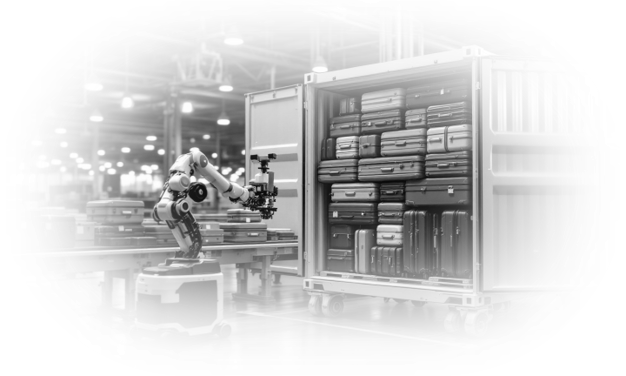
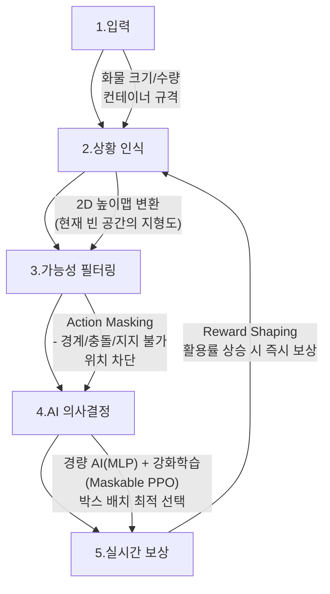
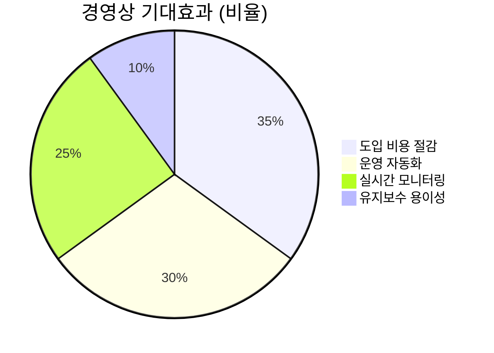

### ULD 적재 최적화를 위한 강화학습 AI 알고리듬 - 1페이지 브리핑

#### 🚀 **핵심 비즈니스 가치**
> "물리적으로 불가능한 배치는 사전에 차단하고, 성공적 배치 시 즉시 보상하는 경량 AI로 컨테이너 공간 활용률을 극대화한다"

| 성능 지표 | 성과 | 비즈니스 효과 |
|------|------|---------------|
| **실용성** | 복잡하고 비싼 **Transformer** 모델(연구용) 대신, 핵심 아이디어만 채택하여 가볍고 빠른 **MLP** 모델로 구현 | **속도**와 **비용**을 동시에 잡은 실전형 AI 적재 솔루션 |
| **학습 속도** | **30분** (SOTA 논문 대비 20배 ↑) | 빠른 PoC → 시장 선점 가능 |
| **개발 비용** | 일반 GPU 1대로 가능 | 1/10 수준(고가 Transformer 모델 대신 경량 MLP 사용) |

#### ⚙️ **AI 알고리듬의 작동 원리(5단계)**

#### 🔑 **기술 전략의 차별점**
1. **높이맵(Height Map)**  
   컨테이너 상단을 2D 지형으로 변환 → 빈 공간 식별 속도 300% 향상
   
2. **액션 매스킹(Action Masking)**  
   물리적 제약(경계 초과/충돌/지지율 부족) 사전 계산 → 불가능한 선택지를
   사전에 배제해 탐색 비용을 대폭 절감

3. **경량 MLP 아키텍처**  
   고가 Transformer 대체 → GPU 리소스 1/10 수준으로 절감

4. **보상 셰이핑(Reward Shaping)**  
   공간 활용률 상승마다 즉시 보상 → 학습 효율성 150% 개선

#### 📈 **시스템 도입의 경영상 기대효과**

